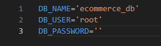

# E-Commerce Back-End

## Description

This application allows a manager of an E-Commerce company to view the back-end of their site to keep track of all their products. It uses Sequelize to communicate with the MySQL database. Insomnia is used to run the database once the server is up and running.

## Table of Contents
  * [Installation](#installation)
  * [Usage](#usage)
  * [Contributing](#contributing)
  * [License](#license)
  * [Contact](#contact)
## Installation

1) Clone down code path to your local machine 
2) Open in VS Code 
3) Create a `.env` file at the root of this directory with contents that look like this: 

4) If you don't have a MySQL account, please create one to continue, directions to do so here: https://dev.mysql.com/doc/mysql-installation-excerpt/5.7/en/
5) Right-click on `server.js` and open in `integrated terminal` 
6) In the terminal type `npm i`
7) Type `mysql -u root -p`, then type your password if one is set up (also in the `.env` file), then `SOURCE db/schema.sql` to create database, then type `exit` to leave MySQL
8) `npm run seed` to create and seed the entire database

## Usage

1) In terminal type `npm start` 
2) Open `Insomnia` to navigate the database

## Contributing

n/a

## Tests

n/a

## License

MIT License

## Contact

GitHub: [@Nehoa21](https://github.com/Nehoa21)

Email: nehoaakina21@yahoo.com

LinkedIn: 
